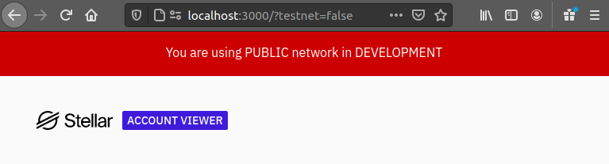

# Stellar Account Viewer 2.0

A simple tool to view an account on the Stellar network and make transactions
from it.

This app replaces the original Account Viewer with an updated framework and
design.

## Developing

We use `create-react-app` with yarn for dependencies.

`yarn`

To start the app in development mode, which will watch for changes to files,
rebuild, and reload the site automatically, run the start script.

`yarn start`

## Building for production

Builds the app for production to the `build` folder.

`yarn build`

## Change network

You can change Account Viewer’s network by setting `testnet` query parameter to
either `true` or `false`. For example, `localhost:3000/?testnet=false`. The red
banner at the top of the page will show that you're on a different network.

